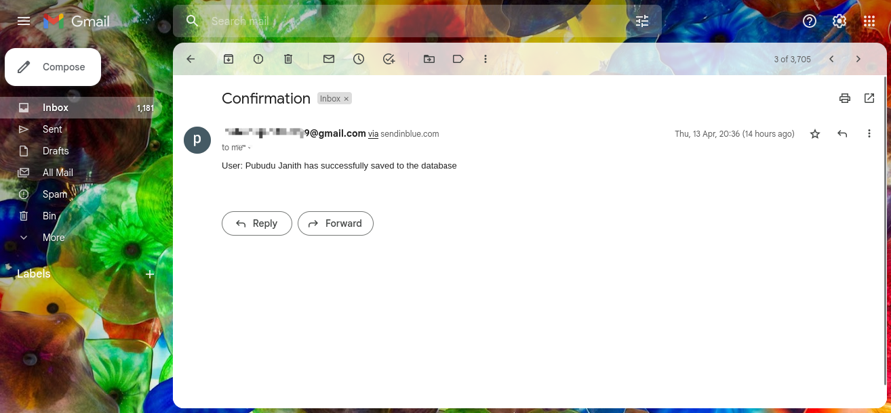

# Emailing with Node.js 

This project was developed to understand and improve on the knowledge of **email sending functionality** in Node.js.
In this project, **user web service** is exposed as an **API** under the **users** resource and more information on the user web 
service with example test cases can be found in the below API documentation.

- [**Users API documentation**](https://documenter.getpostman.com/view/25306703/2s93Xwz4Kk)

Here, emails are sent to the appropriate users via a **third-party email service provider.** 
When a request comes to the **Node.js backend**, an email is sent from the **backend** to the appropriate user with the help of this email service provider. 
**(SMTP server)**

**Brevo's SMTP server** was used as the email service provider for this project. 
It is required to **create an account** in [**Brevo**](https://www.brevo.com/products/transactional-email/) and after creation go to the **SMTP & API 
section** and get the **SMTP server**, **port**, **login email** and **master password.** These details should be filled in the `.env` file as below.

```
EMAIL_HOST=SMTP Server
EMAIL_PORT=port
EMAIL_USERNAME=login email
EMAIL_PASSWORD=master password
```

#### Highlighted feature of the application,

- When the user is saved in the database, an email is sent from the Node.js backend to the user's email address.
- Email was successfully sent to user's email address.<br>
  

## Used Technologies

- Node.js
- Express.js
- Sequelize
- MySQL
- Nodemailer

#### Used Integrated Development Environment
- IntelliJ IDEA

## How to use ?
This project can be used by cloning the project to your local computer.

Make sure to create a **user_db** database in your MySQL server.

#### Clone this repository
1. Clone the project using `https://github.com/PubuduJ/emailing-with-node.git` terminal command.
2. Change the `MYSQL_PASSWORD` in the `.env` file to your local machine MySQL server password.
3. Give the values for `EMAIL_HOST`, `EMAIL_PORT`, `EMAIL_USERNAME` and `EMAIL_PASSWORD` in the `.env` file from your `Brevo` **SMTP Server** account.
4. Open the terminal from the project directory and run `npm install` and `npm start` to run the server.

## Version
v1.0.0

## License
Copyright &copy; 2023 [Pubudu Janith](https://www.linkedin.com/in/pubudujanith/). All Rights Reserved.<br>
This project is licensed under the [MIT license](LICENSE.txt).